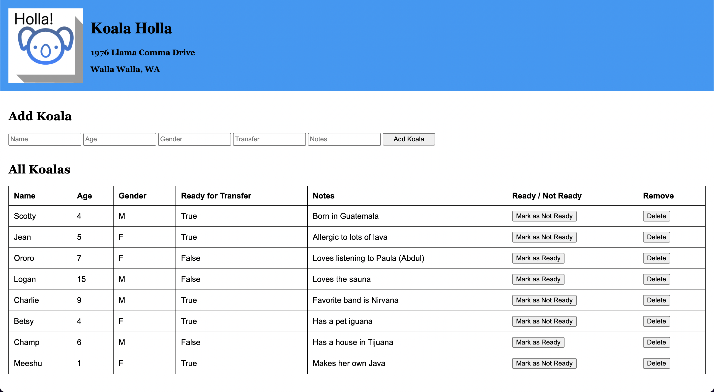

# Koala Holla

## Heroku Link

[Koala Holla](https://safe-citadel-71763.herokuapp.com/)

## Description

This is a Koala Rescue application that uses a database to store each Koala and some characteristics about each of them. The goal is to find each Koala a home and represent whether they are ready to be transferred. As they are entered, each Koala can be toggled between being 'ready' and 'not ready'. The characteristics of each can be called and manipulated at any time to represent their ongoing status.

## Interface

## Languages

JavaScript, CSS, HTML, Postgresql, and Markdown demonstrated.

## Packages

This is built using Node.js with Express, Pg, Nodemon, and jQuery utilized.

## Future Updates

Future updates are unknown at this time. Possibilities would include searching, filtering, and updating other properties.